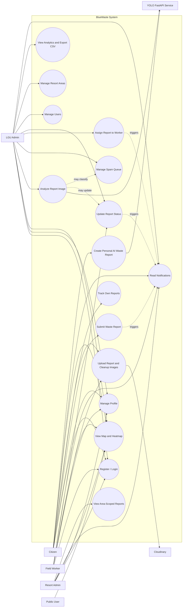
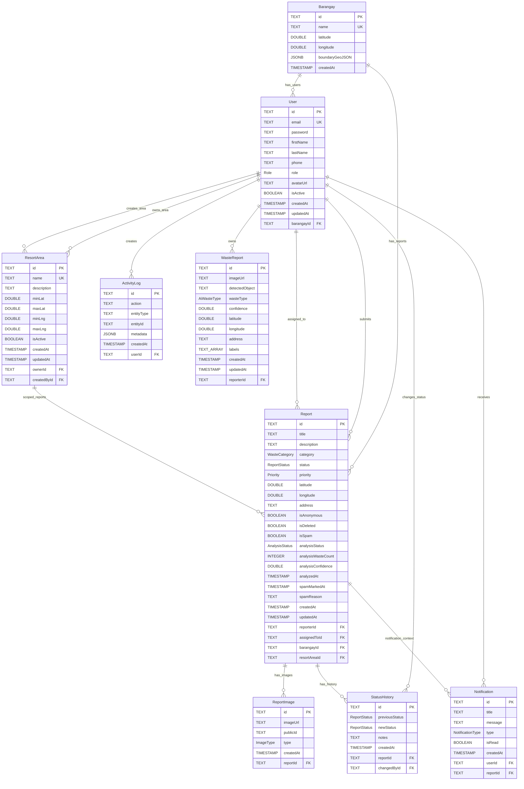
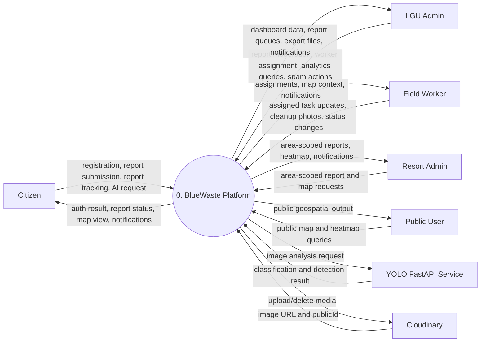
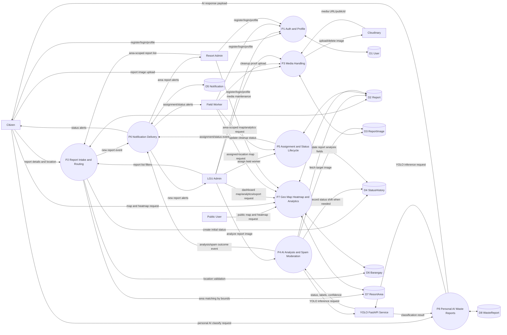

# BlueWaste System Analysis and Diagrams

## 1) System Analysis (Current As-Is)

This analysis is based on the current implementation in:

- Backend routes and controllers in `backend/src`
- Prisma schema in `backend/prisma/schema.prisma`
- Prisma migration SQL files in `backend/prisma/migrations/*/migration.sql`
- Web and mobile route structure in `web/src/app` and `mobile/app`

### 1.1 Core Components

1. Client Applications

- Web app (Next.js): citizen portal, LGU/resort dashboard, field worker dashboard
- Mobile app (Expo): citizen and field worker flows

2. API Layer

- Express REST API with JWT auth
- Role-based authorization (`CITIZEN`, `LGU_ADMIN`, `RESORT_ADMIN`, `FIELD_WORKER`)

3. Data Layer

- PostgreSQL via Prisma
- Main entities: `User`, `Report`, `ReportImage`, `StatusHistory`, `Notification`, `Barangay`, `ResortArea`, `WasteReport`, `ActivityLog`

4. External Services

- Cloudinary for image storage
- YOLO FastAPI for report-image analysis and AI-assisted waste classification

### 1.2 High-Value Business Flows

1. Report lifecycle

- Citizen submits report with location and optional anonymity.
- System auto-matches `ResortArea` by lat/lng bounds.
- LGU can analyze report image using YOLO.
- LGU assigns field worker.
- Worker updates status until `CLEANED`.

2. AI moderation flow

- LGU calls analyze action on a report image.
- YOLO returns decision (`DIRTY` or `CLEAN`) and detection metadata.
- `CLEAN` result moves report to spam queue (`isSpam=true`, `status=REJECTED`) and becomes eligible for auto soft-delete by retention.

3. Geo and monitoring flow

- Public and authenticated users can view map/heatmap data.
- Dashboard analytics provide trends, category distribution, barangay stats, and CSV export.

4. Notification flow

- New report, assignment, and status transitions create user notifications.

---

## 2) Use Case Diagram

---

## 3) ERD Physical Model

### 3.1 ERD (Entity Relationships)

### 3.2 Physical Model Notes (PostgreSQL)

1. Enum types

- `Role`: `CITIZEN`, `LGU_ADMIN`, `RESORT_ADMIN`, `FIELD_WORKER`
- `ReportStatus`: `PENDING`, `VERIFIED`, `CLEANUP_SCHEDULED`, `IN_PROGRESS`, `CLEANED`, `REJECTED`
- `WasteCategory`: `SOLID_WASTE`, `HAZARDOUS`, `LIQUID`, `RECYCLABLE`, `ORGANIC`, `ELECTRONIC`, `OTHER`
- `Priority`: `LOW`, `MEDIUM`, `HIGH`, `CRITICAL`
- `ImageType`: `REPORT`, `CLEANUP`
- `NotificationType`: `NEW_REPORT`, `STATUS_CHANGE`, `ASSIGNMENT`, `SYSTEM`
- `AiWasteType`: `RECYCLABLE`, `NON_RECYCLABLE`, `ORGANIC`
- `AnalysisStatus`: `DIRTY`, `CLEAN`

2. Important index groups

- `Report`: status/category/filtering indexes plus composite operational indexes, including spam and resort-area access paths.
- `Notification`: `(userId, isRead)` and `(userId, createdAt)` for inbox and badge counts.
- `ResortArea`: owner and active-range indexes for area lookup and ownership queries.
- `WasteReport`: `(reporterId, createdAt)` for personal AI history timeline.

3. FK behavior highlights

- `ReportImage -> Report`: `ON DELETE CASCADE`
- `StatusHistory -> Report`: `ON DELETE CASCADE`
- `Notification -> User`: `ON DELETE CASCADE`
- `Notification -> Report`: `ON DELETE SET NULL`
- `Report -> User/Barangay/ResortArea`: mostly `ON DELETE SET NULL`

4. Type note

- Prisma stores IDs as `TEXT` in current migrations, not native `UUID` columns.

---

## 4) DFD Level 0 (Context Diagram)

---

## 5) DFD Level 1 (Process Decomposition)

