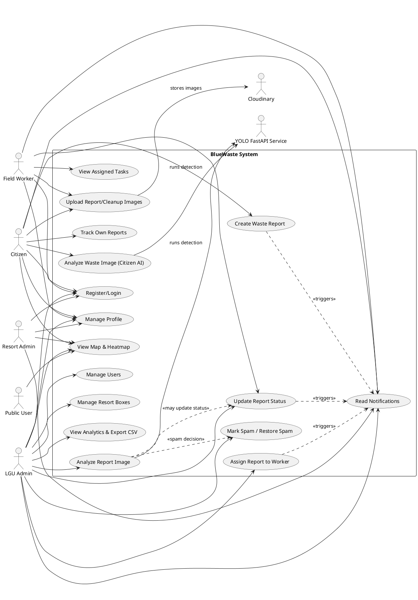
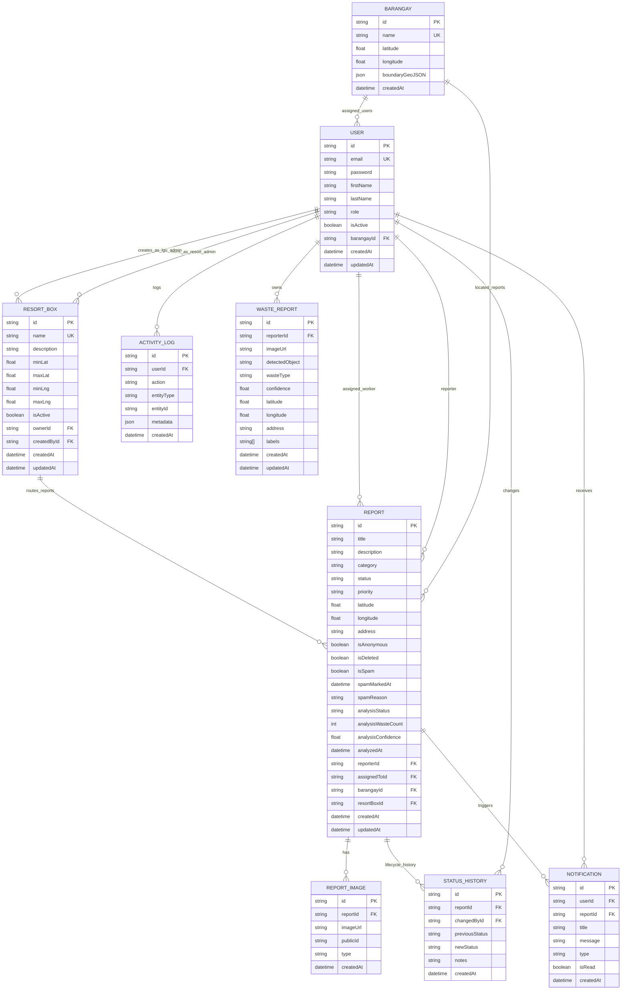
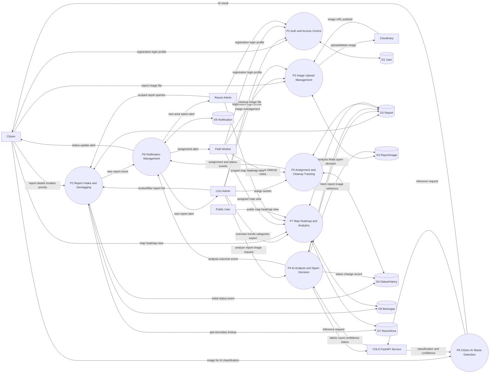

# BlueWaste System Diagrams

## System Analysis

### Architecture Overview

BlueWaste is a multi-client, service-oriented waste management platform composed of:

- Frontend clients:
  - Web app (Next.js) for citizen, field worker, LGU admin, and resort admin workflows
  - Mobile app (Expo/React Native) for citizen and field worker operations
- Backend API:
  - Node.js + Express REST API with JWT authentication and role-based authorization
  - Core domain modules: reports, users, analytics, notifications, uploads, resort boxes, barangays, waste-reports
- AI service:
  - FastAPI + YOLO endpoint (`POST /predict`) for image-based waste detection (`CLEAN` or `DIRTY`)
- Data and storage:
  - PostgreSQL via Prisma for transactional data
  - Cloudinary for report/cleanup/annotated image storage

### Primary Actors and Responsibilities

- Citizen
  - Register/login, submit reports with geolocation and images, track own reports, read notifications
- LGU Admin
  - Review all reports, run AI image analysis, assign workers, update statuses, manage users, manage resort boxes, view analytics/export data
- Field Worker
  - View assigned tasks, update cleanup statuses, upload cleanup evidence images, read notifications
- Resort Admin
  - View reports scoped to owned resort boxes (geofenced areas)
- External Systems
  - YOLO FastAPI service for object detection and report image analysis
  - Cloudinary for image upload and retrieval URLs

### Core Functional Flow

1. Citizen submits a waste report with location and metadata.
2. Backend stores report in PostgreSQL and auto-matches a resort box by geo-bounds.
3. Images are uploaded to Cloudinary and persisted in `ReportImage` records.
4. LGU Admin can analyze report images; backend calls YOLO, updates analysis fields, and can mark spam (`isSpam=true`, `REJECTED`) for clean/no-waste images.
5. LGU Admin assigns reports to field workers; workers update status from active cleanup to completion.
6. Notification records are generated for admins, assigned workers, and reporters during lifecycle events.
7. Map, heatmap, and analytics endpoints aggregate report data for operational monitoring.
8. Citizen web AI detection can classify uploaded images through the YOLO service for on-demand waste typing.

### Key Domain Data Objects

- `User`, `Barangay`, `ResortArea`
- `Report`, `ReportImage`, `StatusHistory`
- `Notification`, `ActivityLog`
- `WasteReport` (AI-detection-oriented report log)

## Use Case Diagram

## ERD

## DFD

### DFD Level 1 (BlueWaste Platform)

