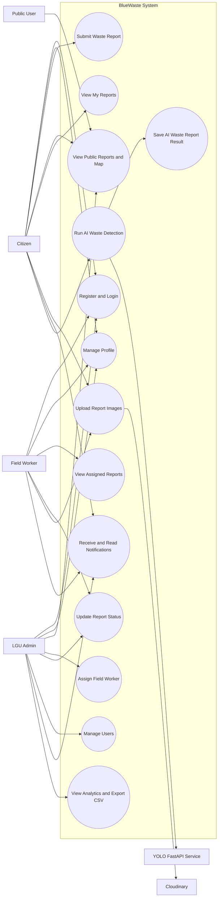
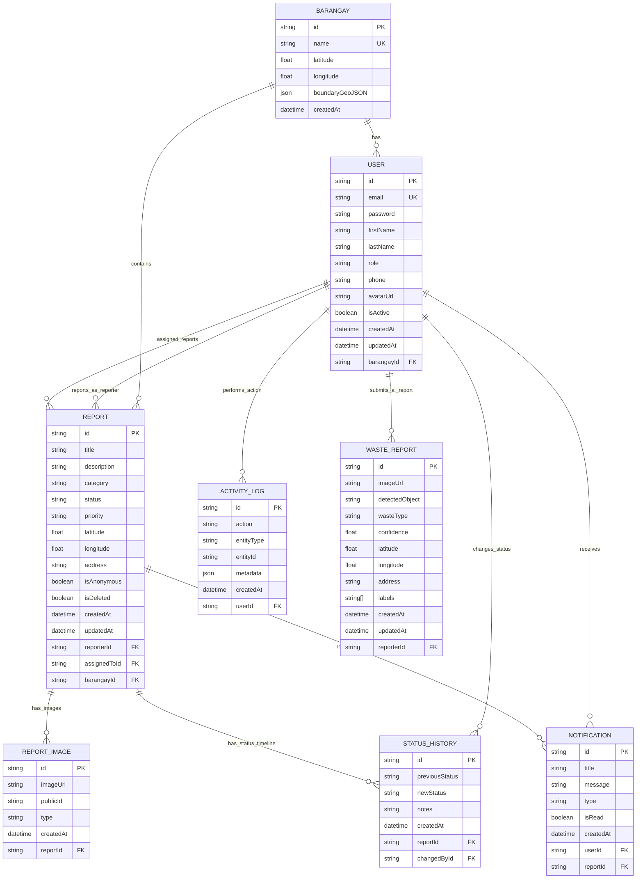
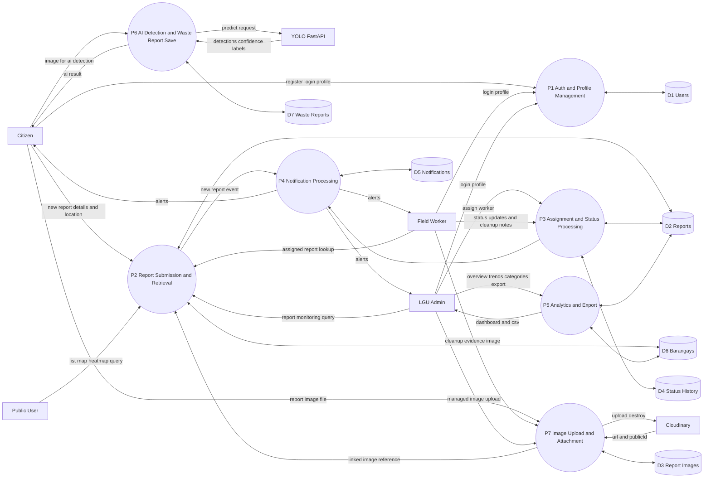

# BlueWaste System Analysis and Diagrams

## 1) Current System Analysis

### Architecture Snapshot

- Client apps: Next.js web app and Expo mobile app
- Main API: Node.js + Express backend with route modules for auth, reports, users, barangays, notifications, analytics, uploads, and AI waste reports
- Primary database: PostgreSQL via Prisma ORM
- External services:
  - Cloudinary for image storage and deletion
  - YOLO FastAPI service for image-based waste detection

### Main Actors

- Citizen: submits reports, tracks personal reports, receives notifications, and uses AI-assisted waste detection
- Field Worker: views assigned reports, uploads evidence images, and updates cleanup status
- LGU Admin: manages users, assigns workers, updates report lifecycle, monitors analytics, and exports data
- Public User: can view report map/heatmap/list and barangay ranking/statistics

### Core Functional Areas

- Identity and access: register/login, profile retrieval/update, role-based authorization
- Report lifecycle: create report, assign worker, update status, soft-delete report, upload report images
- Operations visibility: map points, heatmap, barangay ranking, category distribution, trend/overview analytics, CSV export
- Notification engine: admin notifications on new reports, assignee notifications, reporter status updates, unread counters/read state
- AI-assisted reporting: YOLO prediction result is persisted as WasteReport data associated with a reporter

---

## 2) Use Case Diagram

---

## 3) Entity-Relationship Diagram (ERD)

---

## 4) Data Flow Diagram (DFD Level 1)

