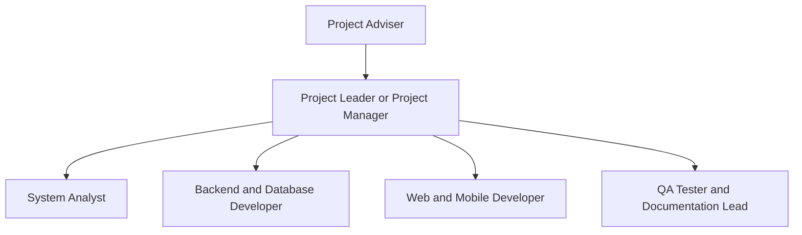
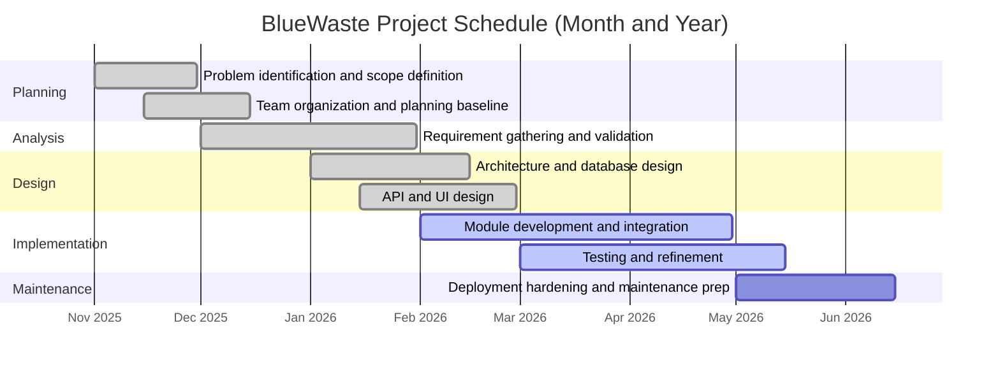
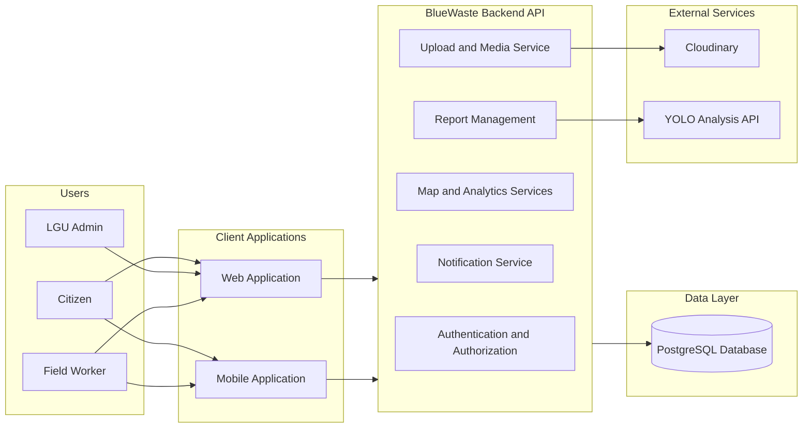

# CHAPTER 2

# METHODOLOGY

This chapter presents the methodology used in the development of the BlueWaste System, a smart waste management platform designed for Panabo City. The project includes a web application, a mobile application, and a centralized backend API connected to a shared PostgreSQL database. This chapter explains how the project was planned, analyzed, designed, developed, and maintained to achieve its goals of improving waste reporting, monitoring, and response.

The BlueWaste development process adopted the PADIM model to ensure a structured and systematic software development lifecycle. As shown in Figure 1, the process follows a sequence of Planning, Analysis, Design, Implementation, and Maintenance. This model supports clear phase-by-phase execution while also allowing continuous improvements based on user feedback, operational challenges, and system performance.

[Insert Figure 1 here: PADIM Model]

Figure 1: PADIM Model for BlueWaste System

## 2.1 System Development Life Cycle (PADIM)

The BlueWaste System followed the PADIM system development life cycle to ensure that each phase of development was organized, measurable, and aligned with project objectives. The five phases of PADIM were executed in sequence and revisited when improvements were needed.

### 2.1.1 Planning

The Planning phase focused on identifying waste-management problems and defining the objectives of BlueWaste. In this phase, the team set the project scope, selected the technology stack, and prepared the development plan for web, mobile, backend, database, and AI-supported features.

### 2.1.2 Analysis

The Analysis phase examined stakeholder needs and translated them into system requirements. Functional requirements included reporting, tracking, map visualization, analytics, and notifications, while non-functional requirements emphasized security, performance, reliability, and scalability.

### 2.1.3 Design

The Design phase defined the overall architecture, database structure, API modules, and role-based user interfaces. BlueWaste was designed with a shared backend and database so both web and mobile applications could operate consistently.

### 2.1.4 Implementation

The Implementation phase involved developing and integrating the backend, web, and mobile components of BlueWaste. Core modules such as authentication, reporting, mapping, analytics, notifications, uploads, and AI-assisted analysis were built, configured, and validated through continuous testing.

### 2.1.5 Maintenance

The Maintenance phase ensures the system remains stable, secure, and effective after deployment. It includes bug fixes, performance optimization, dependency updates, monitoring, and continuous improvement based on operational feedback.

## 2.2 System Planning

The system planning phase focuses on how the researchers conceptualized and organized the development of BlueWaste. A web and mobile-based waste reporting, mapping, and monitoring system for Panabo City. This phase involves identifying the core problem, defining the project scope, assigning responsibilities, and creating a structured development plan to ensure the successful completion of the system.

The idea of the project originated from the observed difficulty in monitoring and managing waste incidents across coastal areas. As report submissions increase, local administrators and field workers face challenges in maintaining visibility, prioritizing response tasks, and tracking cleanup progress through fragmented processes. These concerns led the researchers to propose a centralized platform that can map, track, and manage waste reports efficiently. To ensure a systematic development process, the project follows the PADIM model, which organizes tasks into Planning, Analysis, Design, Implementation, and Maintenance phases. The planning outputs include the project team organization, phase-based work breakdown structure, and Gantt chart schedule shown in the succeeding subsections.

### 2.2.1 Project Team Organization

The organizational chart below follows a typical capstone team composition and can be mapped directly to the member assignments listed in your Project Team Composition (page 4).

Suggested role-responsibility mapping:

| Role                              | Primary Responsibilities                                                          | Assigned Member (Based on Page 4) |
| --------------------------------- | --------------------------------------------------------------------------------- | --------------------------------- |
| Project Leader or Project Manager | Overall planning, coordination, milestone monitoring, final integration decisions | [Insert Name]                     |
| System Analyst                    | Requirement analysis, use-case definition, process documentation                  | [Insert Name]                     |
| Backend and Database Developer    | API development, database schema, migrations, security controls                   | [Insert Name]                     |
| Web and Mobile Developer          | User interface development, client integration, usability improvements            | [Insert Name]                     |
| QA Tester and Documentation Lead  | Test planning, validation, issue tracking, technical documentation                | [Insert Name]                     |

### 2.2.2 Work Breakdown Structure (WBS)

The WBS is phase-based and aligned with PADIM to clearly define project activities and outputs.

```mermaid
flowchart TD
	WBS[BlueWaste Project WBS]

	WBS --> P[1.0 Planning]
	P --> P1[1.1 Identify Problem and Opportunity]
	P --> P2[1.2 Define Scope and Objectives]
	P --> P3[1.3 Organize Team and Assign Roles]
	P --> P4[1.4 Prepare Initial Schedule and Risks]

	WBS --> A[2.0 Analysis]
	A --> A1[2.1 Gather Stakeholder Requirements]
	A --> A2[2.2 Define Functional Requirements]
	A --> A3[2.3 Define Non-Functional Requirements]
	A --> A4[2.4 Validate Requirements]

	WBS --> D[3.0 Design]
	D --> D1[3.1 Design System Architecture]
	D --> D2[3.2 Design Database and ERD]
	D --> D3[3.3 Design API and Module Interfaces]
	D --> D4[3.4 Design Web and Mobile UI]

	WBS --> I[4.0 Implementation]
	I --> I1[4.1 Set Up Development Environment]
	I --> I2[4.2 Develop Backend and Database Features]
	I --> I3[4.3 Develop Web and Mobile Features]
	I --> I4[4.4 Integrate Map, Notification, and AI Components]
	I --> I5[4.5 Conduct Testing and Refinement]

	WBS --> M[5.0 Maintenance]
	M --> M1[5.1 Monitor Production Performance]
	M --> M2[5.2 Apply Bug Fixes and Updates]
	M --> M3[5.3 Optimize Queries and System Security]
	M --> M4[5.4 Continuous Improvement and Documentation]
```

### 2.2.3 Gantt Chart

The Gantt chart below presents the schedule for WBS activities using month and year format.

If your approved timeline uses different months, only the dates in this chart need to be adjusted while keeping the same WBS task sequence.

## 2.3 System Analysis

The system analysis phase describes how BlueWaste requirements were examined before full implementation by translating stakeholder needs into technical specifications and validating how users, data, and system components interact. During this phase, the team analyzed workflows for citizens, local administrators, and field workers, mapped operational challenges into system processes such as report submission, verification, assignment, map-based monitoring, and progress tracking, and defined quality targets such as security, reliability, and performance to ensure that the architecture, features, and expected system behavior align with real waste-management operations.

### 2.3.1 System Architecture

BlueWaste follows a three-tier client-server architecture composed of the presentation layer, application layer, and data layer. This architectural framework defines how users and system components interact, including hardware, software, and data resources that work together to support waste reporting, monitoring, and response operations.

The presentation layer contains both web and mobile user interfaces used by citizens, LGU administrators, and field workers. This layer includes the citizen reporting portal, interactive GIS map and heatmap interfaces, worker task views, and the administrative decision-support dashboard with analytical charts. The web platform provides map and analytics views for management operations, while the mobile platform supports field submission and status updates in on-site environments.

The application layer is composed of server-side services built with Node.js and Express. It handles business logic such as report processing, role-based user authentication, report assignment, status lifecycle management, geolocation data handling, and notification dispatch. RESTful API endpoints connect frontend applications to backend services for secure and structured data exchange.

The data layer uses PostgreSQL as the centralized relational database, accessed through Prisma ORM. It stores core records such as user accounts, geotagged waste reports, report images, cleanup status history, notifications, barangay and resort-area references, and analytics-ready data. External services are integrated in this architecture, including Cloudinary for media storage and a YOLO inference API for AI-assisted image analysis.

In the operational flow, citizens submit waste reports from web or mobile clients using captured coordinates and photo evidence. The application layer validates and processes the submission, stores structured records in PostgreSQL, and links media resources through Cloudinary. The mapping services retrieve report coordinates to render markers and heatmaps, while the LGU dashboard generates trend summaries and spatial insights from stored data to support data-driven cleanup prioritization.

Figure 2: BlueWaste System Architecture

System components are organized as follows:

1. Hardware components: user smartphones and computers, cloud-hosted application server, and managed database infrastructure.
2. Software components: web frontend, mobile frontend, backend REST API, authentication middleware, map and analytics modules, notification and upload services.
3. Data components: user data, report records, geolocation coordinates, report images, status history, and notification logs stored in a centralized PostgreSQL schema.

### 2.3.2 Functional Requirements

Functional requirements define what the BlueWaste system must do for each user role and module.

1. The system shall allow users to register, log in, and manage their profiles based on role.
2. The system shall allow citizens to submit waste reports with description, category, location, and images.
3. The system shall allow citizens to view and track the status of their submitted reports.
4. The system shall allow LGU administrators to review, verify, reject, and manage reported incidents.
5. The system shall allow LGU administrators to assign reports to field workers.
6. The system shall allow field workers to update report status and upload cleanup evidence.
7. The system shall provide map and heatmap views for waste incident visualization.
8. The system shall generate and deliver notifications for report creation, assignments, and status updates.
9. The system shall provide analytics dashboards for trends, category distribution, and barangay-level summaries.
10. The system shall support AI-assisted image analysis for report validation and moderation support.

### 2.3.3 Non-Functional Requirements

Non-functional requirements define the expected quality attributes of BlueWaste.

1. Security: the system must enforce JWT authentication, role-based authorization, and validated request handling.
2. Performance: common report and dashboard queries must be optimized for fast response under normal operational load.
3. Reliability: the system must preserve data consistency and recover gracefully from service errors.
4. Availability: the platform should remain accessible for users during expected service hours with minimal downtime.
5. Scalability: the architecture should support increasing numbers of users, reports, and media files.
6. Usability: interfaces should be easy to use for citizens, administrators, and field workers with minimal training.
7. Maintainability: modules should remain organized and testable to support future enhancements and bug fixes.
8. Compatibility: the system must support web access and mobile access through a shared backend API.
9. Data integrity: report records, status history, and notifications must remain accurate and traceable.
10. Monitoring and auditability: logs and health checks must support issue diagnosis and operational oversight.

### 2.3.4 Data Dictionary

The data dictionary defines the database tables, fields, keys, and field-level descriptions used by BlueWaste. Table 3 shows the complete list of tables, while Table 3.1, Table 3.2, and succeeding tables present the detailed dictionary per table.

Table 3. List of BlueWaste Database Tables

| Table Name    | Description                                                                                  |
| ------------- | -------------------------------------------------------------------------------------------- |
| User          | Stores user account and profile information for citizens, administrators, and field workers. |
| Report        | Stores submitted waste incident reports and lifecycle status information.                    |
| ResortArea    | Stores LGU-defined coverage areas used for report assignment and filtering.                  |
| ReportImage   | Stores image metadata associated with submitted reports.                                     |
| Barangay      | Stores barangay reference records and map coordinates.                                       |
| StatusHistory | Stores report status transition logs and change notes.                                       |
| Notification  | Stores user notifications for assignments, updates, and system events.                       |
| ActivityLog   | Stores auditable user activity events and metadata.                                          |
| WasteReport   | Stores AI-assisted waste detection records and related output labels.                        |

Table 3.1 Data Dictionary for User

| Field Name | Data Type  | Key | Null | Description                                                 |
| ---------- | ---------- | --- | ---- | ----------------------------------------------------------- |
| id         | UUID       | PK  | No   | Unique identifier of the user.                              |
| email      | VARCHAR    | UK  | No   | Unique login email address.                                 |
| password   | VARCHAR    | -   | No   | Hashed password credential.                                 |
| firstName  | VARCHAR    | -   | No   | User given name.                                            |
| lastName   | VARCHAR    | -   | No   | User family name.                                           |
| phone      | VARCHAR    | -   | Yes  | Optional contact number.                                    |
| role       | ENUM(Role) | -   | No   | User role (CITIZEN, LGU_ADMIN, RESORT_ADMIN, FIELD_WORKER). |
| avatarUrl  | VARCHAR    | -   | Yes  | Optional profile image URL.                                 |
| isActive   | BOOLEAN    | -   | No   | Account active status flag.                                 |
| createdAt  | TIMESTAMP  | -   | No   | Date and time when account was created.                     |
| updatedAt  | TIMESTAMP  | -   | No   | Date and time when account was last updated.                |
| barangayId | UUID       | FK  | Yes  | References Barangay.id for user location context.           |

Table 3.2 Data Dictionary for Report

| Field Name         | Data Type            | Key | Null | Description                                      |
| ------------------ | -------------------- | --- | ---- | ------------------------------------------------ |
| id                 | UUID                 | PK  | No   | Unique identifier of the report.                 |
| title              | VARCHAR              | -   | No   | Report title.                                    |
| description        | TEXT                 | -   | No   | Detailed waste incident description.             |
| category           | ENUM(WasteCategory)  | -   | No   | Waste category classification.                   |
| status             | ENUM(ReportStatus)   | -   | No   | Current report lifecycle status.                 |
| priority           | ENUM(Priority)       | -   | No   | Assigned urgency level.                          |
| latitude           | DOUBLE PRECISION     | -   | No   | Latitude coordinate of incident.                 |
| longitude          | DOUBLE PRECISION     | -   | No   | Longitude coordinate of incident.                |
| address            | VARCHAR              | -   | Yes  | Optional textual incident address.               |
| isAnonymous        | BOOLEAN              | -   | No   | Indicates anonymous submission.                  |
| isDeleted          | BOOLEAN              | -   | No   | Soft-delete marker.                              |
| isSpam             | BOOLEAN              | -   | No   | Spam classification marker.                      |
| spamMarkedAt       | TIMESTAMP            | -   | Yes  | Date and time report was marked as spam.         |
| spamReason         | VARCHAR              | -   | Yes  | Reason for spam classification.                  |
| analysisStatus     | ENUM(AnalysisStatus) | -   | Yes  | AI analysis decision status.                     |
| analysisWasteCount | INTEGER              | -   | Yes  | Number of detected waste objects.                |
| analysisConfidence | DOUBLE PRECISION     | -   | Yes  | Confidence value from AI analysis.               |
| analyzedAt         | TIMESTAMP            | -   | Yes  | Date and time of analysis completion.            |
| createdAt          | TIMESTAMP            | -   | No   | Date and time report was created.                |
| updatedAt          | TIMESTAMP            | -   | No   | Date and time report was last updated.           |
| reporterId         | UUID                 | FK  | Yes  | References User.id of reporting user.            |
| assignedToId       | UUID                 | FK  | Yes  | References User.id of assigned field worker.     |
| barangayId         | UUID                 | FK  | Yes  | References Barangay.id of report location.       |
| resortAreaId       | UUID                 | FK  | Yes  | References ResortArea.id of mapped service area. |

Table 3.3 Data Dictionary for ResortArea

| Field Name  | Data Type        | Key | Null | Description                              |
| ----------- | ---------------- | --- | ---- | ---------------------------------------- |
| id          | UUID             | PK  | No   | Unique identifier of the resort area.    |
| name        | VARCHAR          | UK  | No   | Unique resort area name.                 |
| description | TEXT             | -   | Yes  | Optional area description.               |
| minLat      | DOUBLE PRECISION | -   | No   | Minimum latitude boundary.               |
| maxLat      | DOUBLE PRECISION | -   | No   | Maximum latitude boundary.               |
| minLng      | DOUBLE PRECISION | -   | No   | Minimum longitude boundary.              |
| maxLng      | DOUBLE PRECISION | -   | No   | Maximum longitude boundary.              |
| isActive    | BOOLEAN          | -   | No   | Active area status.                      |
| createdAt   | TIMESTAMP        | -   | No   | Date and time area was created.          |
| updatedAt   | TIMESTAMP        | -   | No   | Date and time area was last updated.     |
| ownerId     | UUID             | FK  | No   | References User.id of resort area owner. |
| createdById | UUID             | FK  | No   | References User.id of creator.           |

Table 3.4 Data Dictionary for ReportImage

| Field Name | Data Type       | Key | Null | Description                               |
| ---------- | --------------- | --- | ---- | ----------------------------------------- |
| id         | UUID            | PK  | No   | Unique identifier of report image record. |
| imageUrl   | VARCHAR         | -   | No   | Public URL of uploaded image.             |
| publicId   | VARCHAR         | -   | No   | Cloudinary public identifier.             |
| type       | ENUM(ImageType) | -   | No   | Image type (REPORT or CLEANUP).           |
| createdAt  | TIMESTAMP       | -   | No   | Date and time image was uploaded.         |
| reportId   | UUID            | FK  | No   | References Report.id parent report.       |

Table 3.5 Data Dictionary for Barangay

| Field Name      | Data Type        | Key | Null | Description                           |
| --------------- | ---------------- | --- | ---- | ------------------------------------- |
| id              | UUID             | PK  | No   | Unique identifier of barangay record. |
| name            | VARCHAR          | UK  | No   | Unique barangay name.                 |
| latitude        | DOUBLE PRECISION | -   | No   | Barangay reference latitude.          |
| longitude       | DOUBLE PRECISION | -   | No   | Barangay reference longitude.         |
| boundaryGeoJSON | JSONB            | -   | Yes  | Optional polygon boundary geometry.   |
| createdAt       | TIMESTAMP        | -   | No   | Date and time barangay was created.   |

Table 3.6 Data Dictionary for StatusHistory

| Field Name     | Data Type          | Key | Null | Description                                 |
| -------------- | ------------------ | --- | ---- | ------------------------------------------- |
| id             | UUID               | PK  | No   | Unique identifier of status history record. |
| previousStatus | ENUM(ReportStatus) | -   | Yes  | Previous report status value.               |
| newStatus      | ENUM(ReportStatus) | -   | No   | Updated report status value.                |
| notes          | TEXT               | -   | Yes  | Optional status update notes.               |
| createdAt      | TIMESTAMP          | -   | No   | Date and time of status change.             |
| reportId       | UUID               | FK  | No   | References Report.id being updated.         |
| changedById    | UUID               | FK  | No   | References User.id who changed status.      |

Table 3.7 Data Dictionary for Notification

| Field Name | Data Type              | Key | Null | Description                                |
| ---------- | ---------------------- | --- | ---- | ------------------------------------------ |
| id         | UUID                   | PK  | No   | Unique identifier of notification.         |
| title      | VARCHAR                | -   | No   | Notification title text.                   |
| message    | TEXT                   | -   | No   | Notification message body.                 |
| type       | ENUM(NotificationType) | -   | No   | Notification category.                     |
| isRead     | BOOLEAN                | -   | No   | Read/unread state flag.                    |
| createdAt  | TIMESTAMP              | -   | No   | Date and time notification was created.    |
| userId     | UUID                   | FK  | No   | References User.id notification recipient. |
| reportId   | UUID                   | FK  | Yes  | References Report.id context record.       |

Table 3.8 Data Dictionary for ActivityLog

| Field Name | Data Type | Key | Null | Description                               |
| ---------- | --------- | --- | ---- | ----------------------------------------- |
| id         | UUID      | PK  | No   | Unique identifier of activity log record. |
| action     | VARCHAR   | -   | No   | Action name performed by user.            |
| entityType | VARCHAR   | -   | No   | Domain entity type affected.              |
| entityId   | UUID      | -   | No   | Identifier of affected entity record.     |
| metadata   | JSONB     | -   | Yes  | Optional structured action metadata.      |
| createdAt  | TIMESTAMP | -   | No   | Date and time activity was logged.        |
| userId     | UUID      | FK  | No   | References User.id actor.                 |

Table 3.9 Data Dictionary for WasteReport

| Field Name     | Data Type         | Key | Null | Description                               |
| -------------- | ----------------- | --- | ---- | ----------------------------------------- |
| id             | UUID              | PK  | No   | Unique identifier of AI waste report.     |
| imageUrl       | VARCHAR           | -   | No   | Source image URL analyzed by AI.          |
| detectedObject | VARCHAR           | -   | No   | Detected object label returned by AI.     |
| wasteType      | ENUM(AiWasteType) | -   | No   | Classified waste type.                    |
| confidence     | DOUBLE PRECISION  | -   | No   | Detection confidence score.               |
| latitude       | DOUBLE PRECISION  | -   | Yes  | Optional detection latitude.              |
| longitude      | DOUBLE PRECISION  | -   | Yes  | Optional detection longitude.             |
| address        | VARCHAR           | -   | Yes  | Optional textual address.                 |
| labels         | TEXT[]            | -   | No   | Array of extracted labels/tags.           |
| createdAt      | TIMESTAMP         | -   | No   | Date and time AI report was created.      |
| updatedAt      | TIMESTAMP         | -   | No   | Date and time AI report was last updated. |
| reporterId     | UUID              | FK  | Yes  | References User.id creator/owner.         |

## 2.4 Technologies, Concepts, and Theories

This section discusses the core concepts, algorithms, and emerging technologies applied in BlueWaste. The system combines geospatial decision support, web and mobile application engineering, and AI-assisted image analysis to support report intake, validation, monitoring, and cleanup coordination. It also presents the technologies used in development together with their definition, interface snapshot reference, and utilization in the system.

### 2.4.1 Core Concepts and Theoretical Foundations

BlueWaste is grounded on a three-tier client-server architecture, where presentation, application, and data layers are separated for maintainability and scalability. It also adopts GIS-based decision support principles, where spatial data (latitude, longitude, barangay context, and mapped areas) are transformed into visual insights through markers and heatmaps. For waste image moderation and assisted validation, the system applies computer vision concepts using object detection outputs from YOLO inference. Security and governance are handled through role-based access control and authenticated API interaction, ensuring that each user role can only perform authorized actions.

### 2.4.2 Model and Algorithm Workflow

BlueWaste applies an YOLOv8 image analysis workflow for report images. The workflow follows data collection, data pre-processing, feature extraction, and classification phases.

#### 2.4.2.1 Data Collection

Data are collected from operational use of the platform, particularly from citizen and worker report submissions that include images, textual descriptions, category labels, and geolocation coordinates. These records form the primary input set for monitoring and optional AI-assisted moderation. Supporting map data such as barangay references and resort-area boundaries are also collected for geospatial context.

#### 2.4.2.2 Data Pre-processing

Before analysis and storage, incoming report payloads are validated for required fields, accepted formats, and role-based request permissions. Image files are checked through upload middleware, linked to managed storage, and prepared for inference requests when AI analysis is triggered. Structured fields such as coordinates, category values, status values, and foreign-key references are normalized to maintain consistency in the PostgreSQL schema.

#### 2.4.2.3 Feature Extraction

For AI-assisted image evaluation, the YOLO inference service extracts multi-scale visual features from uploaded report images through convolution-based feature maps. These extracted visual patterns represent potential waste-related objects and scene characteristics, which are used to compute bounding boxes, confidence scores, and detection outputs.

#### 2.4.2.4 Classification

After feature extraction, the model produces object-level predictions and confidence values, which are interpreted by BlueWaste services for moderation support and analytics enrichment. Classification outputs are translated into operational indicators such as detected waste presence, confidence level, and analysis status values (for example CLEAN or DIRTY) used in report processing and dashboard summaries.

### 2.4.3 Technologies Used in Development

BlueWaste uses Node.js with Express for backend services, PostgreSQL with Prisma ORM for data management, the Next.js framework for the web application, and Flutter for mobile access. For geospatial and dashboard features, the system uses Leaflet.js with OpenStreetMap, heatmap and clustering plugins, and Chart.js for analytics visualization. Cloudinary manages uploaded images, while a YOLO inference API supports AI-assisted image analysis and moderation. Table 4 summarizes the major technologies, definitions, interface snapshots, and actual utilization in the project.

Table 4. Development Technologies for BlueWaste

| Technology                             | Definition                                                                                                        | Interface Snapshot | Utilization in BlueWaste                                                                                                                     |
| -------------------------------------- | ----------------------------------------------------------------------------------------------------------------- | ------------------ | -------------------------------------------------------------------------------------------------------------------------------------------- |
| Node.js with Express                   | JavaScript runtime and backend web framework for API services.                                                    | Figure 3           | Implemented RESTful backend endpoints, middleware, and business logic for reporting, assignment, notifications, and analytics.               |
| Next.js with Tailwind CSS              | The Next.js framework is a React-based web framework with utility-first CSS styling support through Tailwind CSS. | Figure 4           | Built the web application interfaces for citizens and administrators, including maps, report views, and dashboard pages.                     |
| Flutter                                | Cross-platform framework for mobile app development.                                                              | Figure 5           | Developed the mobile client for citizen submissions and worker-side status updates in field operations.                                      |
| PostgreSQL with Prisma ORM             | Relational database and type-safe ORM for schema and query management.                                            | Figure 6           | Stored and managed core entities such as users, reports, images, status history, and notifications through structured models and migrations. |
| Leaflet.js and Heatmap/Cluster Plugins | Web mapping library and visualization plugins for spatial data rendering.                                         | Figure 7           | Rendered report markers, clustering, and heatmap overlays for location-based incident monitoring.                                            |
| Chart.js                               | Data visualization library for analytical charts.                                                                 | Figure 8           | Displayed trends, category distributions, and barangay-level summaries in decision-support dashboards.                                       |
| Cloudinary                             | Cloud media management platform for image storage and delivery.                                                   | Figure 9           | Managed uploaded report and cleanup images through URL-based references and media metadata tracking.                                         |
| YOLO Inference API (FastAPI)           | Computer vision model-serving API for object detection tasks.                                                     | Figure 10          | Performed AI-assisted image analysis and returned detection outputs used for moderation support and report insights.                         |
| JSON Web Token (JWT)                   | Token-based authentication standard for stateless authorization.                                                  | Figure 11          | Secured API access, authenticated sessions, and enforced role-based route permissions across modules.                                        |

### 2.4.4 Interface Snapshot Placeholders

Insert the following interface snapshots in the manuscript to support Table 4:

1. Figure 3. Backend API module and endpoint testing interface.
2. Figure 4. BlueWaste web dashboard and reporting interface.
3. Figure 5. BlueWaste Flutter mobile report submission screen.
4. Figure 6. Prisma schema or Prisma Studio database view.
5. Figure 7. Leaflet map with markers and heatmap overlay.
6. Figure 8. Analytics dashboard charts generated using Chart.js.
7. Figure 9. Cloudinary media asset management interface.
8. Figure 10. YOLO prediction response interface.
9. Figure 11. JWT authentication flow or secured endpoint verification.
